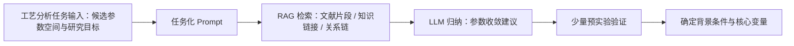

# 4.4 RAG + LLM 写作整理说明

## 目标

本文档用于统一第 3 章“工艺分析任务”与第 4.4 节“知识增强结果分析”的写法，便于后续论文撰写。核心原则是：

- 第 3 章强调系统能力：知识增强系统如何支持工艺分析任务
- 第 4 章强调实验分析：知识增强如何参与参数收敛、关系建模与结果解释
- 第 4.4 节不写成算法消融章节，而写成“关系分析 -> 建模 -> 证据解释”的闭环

## 统一口径

建议在论文中统一使用以下术语：

- 工艺分析任务
- 候选参数空间
- 研究目标
- 参数收敛建议
- 背景条件固定
- 核心变量筛选

不建议使用的表达：

- 先固定参数，再反向追问“为什么固定”
- 直接把知识增强描述成“自动给出最优参数”

更合理的逻辑应为：

1. 给定候选参数空间和研究目标
2. 将问题组织为工艺分析任务 Prompt
3. 通过 RAG 检索文献证据、知识链接和关系链
4. 由 LLM 对检索结果进行归纳，生成参数收敛建议
5. 结合少量预实验结果，完成背景条件固定与核心变量筛选

## 建议的 4.4 结构

建议将第 4.4 节写成三个小节：

- `4.4.1 工艺参数与关键形貌特征的对应关系分析`
- `4.4.2 工艺参数驱动的关键形貌关系建模`
- `4.4.3 基于证据链的建模结果解释`

其中：

- `4.4.1` 先讲趋势分析、变量收敛和参数选择依据
- `4.4.2` 讲工艺参数到关键形貌指标的建模结果
- `4.4.3` 讲 RAG + LLM 的知识增强案例，以及模型结果的证据链解释

## 4.4.1 的写法建议

### 本节角色

本节主要回答两个问题：

- 工艺参数与关键形貌之间是否存在稳定的对应关系
- 为什么在后续建模中选择特定子集和特定变量

### 本节不宜写得过重的内容

正文中不建议展开：

- `L0/L4` 等长度阈值细节
- `mean/trimmed_mean`
- `uniform/sqrt_length/length`

这些内容可作为技术支撑存在，但不应成为本节主角。

### 建议放入正文的引入句

可直接使用下面这段：

> 在工艺参数收敛过程中，本文并非直接预设固定背景条件，而是先结合第 3 章构建的知识增强模块，对候选参数空间进行先验分析；随后再结合少量预实验结果，从样品导电性、制备稳定性和后续形貌分析可比性等角度完成背景条件固定与核心变量筛选。相应流程如图4-x所示。

### 本节建议展开的核心内容

1. 说明分析对象  
   在 `ZZY` 数据中，选取固定背景条件下的 `50000x` 子集作为主要分析对象；重点分析 `Fe power`、`Fe thickness` 和 `anneal_time` 对关键形貌的影响。

2. 说明输出指标  
   关键形貌指标包括：
   - `alignment`
   - `curvature`
   - `waviness_ratio`
   - `tortuosity`

3. 趋势分析与相关性分析  
   重点写：
   - `anneal_time` 增加时，`waviness_ratio` 和 `tortuosity` 整体上升，`alignment` 下降
   - `Fe power` 与 `Fe thickness` 对弯曲特征和整体有序性存在联合作用
   - 关系并非完全线性，尤其 `Fe power` 更接近分档响应而非连续线性响应

4. 参数选择理由  
   建议写成：
   - 结合第 3 章知识增强分析，可获得候选参数收敛方向
   - 结合少量预实验与数据分布，最终固定背景条件
   - 再将 `Fe power`、`Fe thickness` 和 `anneal_time` 作为核心变量进入后续建模

## 4.4.1 的简要流程图

图题建议：

`图4-x 知识增强辅助参数收敛流程`

Mermaid 文案如下：

## 4.4.2 的写法建议

### 本节角色

本节主要回答：

- 工艺参数与关键形貌之间的关系是否能够被模型学习
- 在当前样本规模下，模型能够达到怎样的稳定性

### 建议写法

本节建议以“关系建模”而非“高精度预测”为主线。

输入特征：

- `Fe power`
- `Fe thickness`
- `anneal_time`
- 少量派生特征

输出指标：

- `alignment`
- `curvature`
- `waviness_ratio`
- `tortuosity`

评价指标：

- `R²`
- `RMSE`
- `MAE`

建议正文表述：

- 取向度预测效果最好
- 曲率、波曲度和迂曲度表现出中等可学习性
- 引入基于重复样本方差的噪声感知权重后，模型性能进一步提升

当前可引用的结果为：

- `alignment`: `R² = 0.5892`
- `curvature`: `R² = 0.3994`
- `waviness_ratio`: `R² = 0.3545`
- `tortuosity`: `R² = 0.3623`

## 4.4.3 的写法建议

### 本节角色

本节是知识增强部分的核心展示，用于说明：

- 知识增强不仅用于结果解释
- 还参与了参数空间收敛与变量筛选

### 建议展示方式

本节推荐展示一组“工艺分析任务”的完整示例：

1. 输入候选参数空间与研究目标
2. 展示 Prompt
3. 展示 RAG 检索结果
   - 文献片段
   - 知识链接
   - 关系链路径
4. 展示 LLM 综合建议
5. 说明如何结合少量预实验完成最终参数确定

### 建议放入正文的完整案例段

可直接使用下面这段：

> 为说明知识增强模块在参数设计中的作用，本文以工艺参数收敛任务为例进行展示。首先，将候选参数空间及研究目标组织为任务提示输入系统，其中候选参数包括 `Al2O3 power`、`Al2O3 thickness`、`Ar/H2/C2H4`、`anneal_temp`、`growth_temp`、`growth_time`、`Fe power`、`Fe thickness` 和 `anneal_time`，研究目标则包括样品导电性、制备稳定性以及后续形貌分析的可比性。随后，系统通过 RAG 模块检索与上述参数相关的文献证据、结构化知识链接和关系链，并由 LLM 对检索结果进行归纳，输出背景条件固定建议、重点分析变量及仍需预实验验证的参数项。检索结果表明，`Al2O3` 支撑层与 `Fe` 催化剂是垂直阵列生长中的常见基础组合，支撑层稳定性对催化剂行为具有重要影响；`Fe thickness` 与催化剂团聚、阵列均匀生长和取向退化密切相关；`anneal_time` 则与导电性提升、催化剂寿命及形貌演化有关。基于上述证据，LLM 建议优先将支撑层参数、气氛条件和热处理条件收敛为背景工艺，而将 `Fe power`、`Fe thickness` 和 `anneal_time` 保留为后续工艺-形貌关系分析的核心变量。最后，再结合少量预实验结果，对样品导电性、图像质量和制备稳定性进行验证，最终确定背景条件，并完成参数空间收敛。该案例表明，知识增强模块在本文中并非简单用于结果解释，而是能够在实验设计阶段提供参数筛选和变量收敛的先验支持。

## Prompt 模板建议

建议将该部分描述为“工艺分析任务 Prompt”，而不是一般问答式 Prompt。

推荐结构：

1. 候选参数空间
2. 当前研究目标
3. 分析要求
4. 输出格式

建议的说明句：

> 针对工艺分析任务，本文将候选参数空间与研究目标共同组织为任务提示词输入系统，RAG 模块首先检索相关文献证据、知识链接与关系链，再由 LLM 对检索结果进行归纳，输出背景条件固定建议、核心变量筛选建议及待验证参数项，从而形成面向实验设计的知识增强参数收敛结果。

## 图表建议

建议至少配置以下图表：

1. `图4-x 知识增强辅助参数收敛流程图`
2. `图4-x 工艺参数与关键形貌特征相关性热图`
3. `图4-x 退火时间对关键形貌指标的趋势图`
4. `表4-x 最终模型结果表`
5. `表4-x 知识增强参数收敛示例表`

其中“知识增强参数收敛示例表”建议包含如下列：

- 参数类别
- 检索证据摘要
- LLM 建议
- 预实验验证结果
- 最终处理方式

## 可引用的数据与示例文件

### 4.4 数据分析包

- `D:\CNTDATA\CNTA_ML_Project\reports\paper_section_4_4_data_bundle_20260402`

关键文件：

- `D:\CNTDATA\CNTA_ML_Project\reports\paper_section_4_4_data_bundle_20260402\spearman_correlation_heatmap.png`
- `D:\CNTDATA\CNTA_ML_Project\reports\paper_section_4_4_data_bundle_20260402\anneal_time_trend.png`
- `D:\CNTDATA\CNTA_ML_Project\reports\paper_section_4_4_data_bundle_20260402\final_model_best_results.csv`
- `D:\CNTDATA\CNTA_ML_Project\reports\paper_section_4_4_data_bundle_20260402\cv_overall_summary.csv`

### 知识增强参数收敛示例

- `D:\CNTDATA\CNTA_ML_Project\reports\paper_section_4_4_data_bundle_20260402\knowledge_prompt_demo_20260402`

关键文件：

- `D:\CNTDATA\CNTA_ML_Project\reports\paper_section_4_4_data_bundle_20260402\knowledge_prompt_demo_20260402\prompt.txt`
- `D:\CNTDATA\CNTA_ML_Project\reports\paper_section_4_4_data_bundle_20260402\knowledge_prompt_demo_20260402\qa_result.json`
- `D:\CNTDATA\CNTA_ML_Project\reports\paper_section_4_4_data_bundle_20260402\knowledge_prompt_demo_20260402\tccer_result.json`
- `D:\CNTDATA\CNTA_ML_Project\reports\paper_section_4_4_data_bundle_20260402\knowledge_prompt_demo_20260402\llm_synthesis.md`

## 最终建议

建议后续撰写时严格区分三层功能：

- 第 3 章：知识增强系统如何支持工艺分析任务
- 第 4.4.1：知识增强参与了参数收敛，但这里只简要交代
- 第 4.4.3：完整展示一次“Prompt -> RAG -> LLM -> 参数收敛建议 -> 预实验验证”的案例

这样既能保证全文逻辑统一，也能突出知识增强在实验设计和结果解释中的双重作用。
